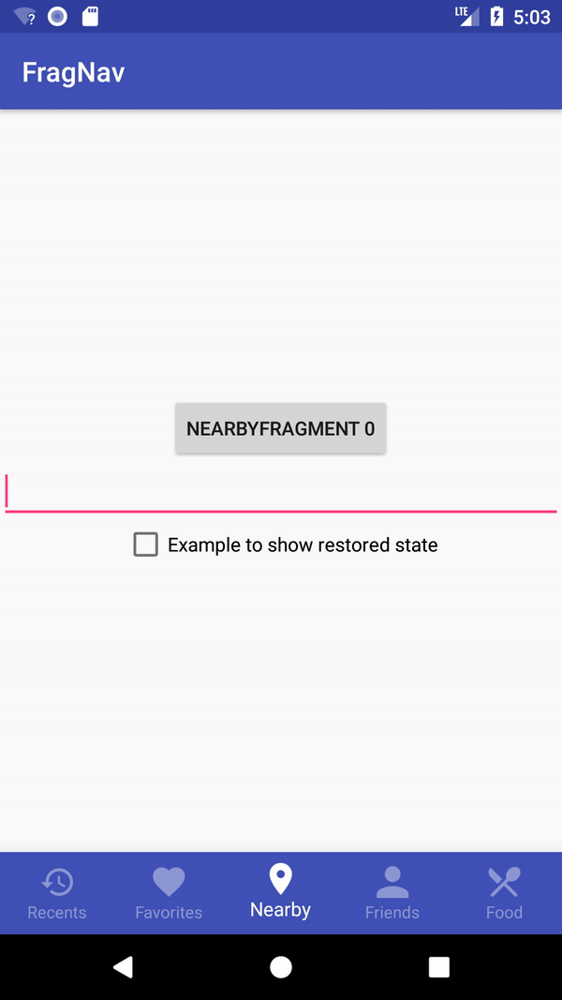
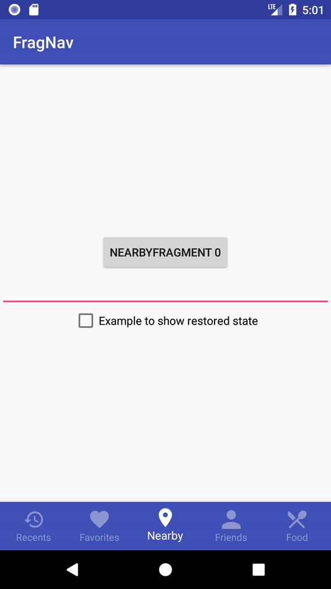

[](https://travis-ci.org/ncapdevi/FragNav)

# FragNav
Android library for managing multiple stacks of fragments (e.g., [Bottom Navigation ](https://www.google.com/design/spec/components/bottom-navigation.html), [Navigation Drawer](https://www.google.com/design/spec/patterns/navigation-drawer.html)).  This library does NOT include the UI for bottom tab bar layout.  For that, I recommend either [BottomBar](https://github.com/roughike/BottomBar) (which is the library shown in the demo) or [AHBottomNavigation](https://github.com/aurelhubert/ahbottomnavigation). This library helps maintain order after pushing onto and popping from multiple stacks(tabs). It also helps with switching between desired tabs and clearing the stacks.


## Donations
Did I help you out, save you some time, make your life easier? Oh, cool. Want to say thanks, buy me a coffee or a beer? HEY THANKS! I appreciate it.

[Cash App](https://cash.me/$NicCapdevila)

[Paypal](https://paypal.me/ncapdev)

[Venmo](http://www.venmo.com/code?user_id=1774909453762560167)


## Sample
With [Material Design Bottom Navigation pattern](https://www.google.com/design/spec/components/bottom-navigation.html), and other tabbed navigation, managing multiple stacks of fragments can be a real headache.  The example file shows best practice for navigating deep within a tab stack.

## Gradle

```groovy
implementation 'com.ncapdevi:frag-nav:3.2.0'   //or or `compile` if on older gradle version
```

## How do I implement it?

### Initialize using a builder and one of two methods
```kotlin
    private val fragNavController: FragNavController = FragNavController(supportFragmentManager, R.id.container)
```
#### 1.
Create a list of fragments and pass them in
```kotlin
 val fragments = listOf(
                RecentsFragment.newInstance(0),
                FavoritesFragment.newInstance(0),
                NearbyFragment.newInstance(0),
                FriendsFragment.newInstance(0),
                FoodFragment.newInstance(0),
                RecentsFragment.newInstance(0),
                FavoritesFragment.newInstance(0),
                NearbyFragment.newInstance(0),
                FriendsFragment.newInstance(0),
                FoodFragment.newInstance(0),
                RecentsFragment.newInstance(0),
                FavoritesFragment.newInstance(0))

fragNavController.rootFragments = fragments
```

#### 2.


Allow for dynamically creating the base class by implementing the NavListener in your class and overriding the getRootFragment method

```java
public class YourActivity extends AppCompatActivity implements FragNavController.RootFragmentListener {
```

```java
fragNavController.rootFragmentListener = this
```

```kotlin

    override val numberOfRootFragments: Int = 5

    override fun getRootFragment(index: Int): Fragment {
        when (index) {
            INDEX_RECENTS -> return RecentsFragment.newInstance(0)
            INDEX_FAVORITES -> return FavoritesFragment.newInstance(0)
            INDEX_NEARBY -> return NearbyFragment.newInstance(0)
            INDEX_FRIENDS -> return FriendsFragment.newInstance(0)
            INDEX_FOOD -> return FoodFragment.newInstance(0)
        }
        throw IllegalStateException("Need to send an index that we know")
    }

```

#### 3.
```java
        fragNavController.initialize(FragNavController.TAB3, savedInstanceState)
```

### SaveInstanceState

Send in  the supportFragment Manager, a list of base fragments, the container that you'll be using to display fragments.
After that, you have four main functions that you can use
In your activity, you'll also want to override your onSaveInstanceState like so

```kotlin
    override fun onSaveInstanceState(outState: Bundle?) {
        super.onSaveInstanceState(outState)
        fragNavController.onSaveInstanceState(outState!!)

    }
```

### Switch tabs
Tab switching is indexed to try to prevent you from sending in wrong indices. It also will throw an error if you try to switch to a tab you haven't defined a base fragment for.

```java
fragNavController.switchTab(NavController.TAB1);
```

### Push a fragment
You can only push onto the currently selected index
```java
        fragNavController.pushFragment(FoodFragment.newInstance())
```

### Pop a fragment
You can only pop from the currently selected index. This can throw an UnsupportedOperationException if trying to pop the root fragment
```java
        fragNavController.popFragment();
```
### Pop multiple fragments
You can pop multiple fragments at once, with the same rules as above applying.  If the pop depth is deeper than possible, it will stop when it gets to the root fragment
```java
       fragNavController.popFragments(3);
```
### Replacing a fragment
You can only replace onto the currently selected index
```java
        fragNavController.replaceFragment(Fragment fragment);
```
### You can also clear the stack to bring you back to the base fragment
```java
        fragNavController.clearStack();
```
### You can also navigate your DialogFragments using
```java
        showDialogFragment(dialogFragment);
        clearDialogFragment();
        getCurrentDialogFrag()
```

### Transaction Options
All of the above transactions can also be done with defined transaction options.
The FragNavTransactionOptions have a builder that can be used.
```kotlin
class FragNavTransactionOptions private constructor(builder: Builder) {
    val sharedElements: List<Pair<View, String>> = builder.sharedElements
    @FragNavController.Transit
    val transition = builder.transition
    @AnimRes
    val enterAnimation = builder.enterAnimation
    @AnimRes
    val exitAnimation = builder.exitAnimation
    @AnimRes
    val popEnterAnimation = builder.popEnterAnimation
    @AnimRes
    val popExitAnimation = builder.popExitAnimation
    @StyleRes
    val transitionStyle = builder.transitionStyle
    val breadCrumbTitle: String? = builder.breadCrumbTitle
    val breadCrumbShortTitle: String? = builder.breadCrumbShortTitle
    val allowStateLoss: Boolean = builder.allowStateLoss

```

### Get informed of fragment transactions
Have your activity implement FragNavController.TransactionListener
 and you will have methods that inform you of tab switches or fragment transactions

A sample application is in the repo if you need to see how it works.

### Fragment Transitions

Can be set using the transactionOptions


## Restoring Fragment State
Fragments transitions in this library use attach()/detch() (http://daniel-codes.blogspot.com/2012/06/fragment-transactions-reference.html).  This is a delibrate choice in order to maintain the fragment's lifecycle, as well as being optimal for memory.  This means that fragments will go through their proper lifecycle  https://developer.android.com/guide/components/fragments.html#Lifecycle . This lifecycle includes going through `OnCreateView` which means that if you want to maintain view states, that is outside the scope of this library, and is up to the indiviudal fragment.  There are plenty of resources out there that will help you design your fragments in such a way that their view state can be restored https://inthecheesefactory.com/blog/fragment-state-saving-best-practices/en and there are libraries that can help restore other states https://github.com/frankiesardo/icepick  

## Special Use Cases

### History & Back navigation between tabs

The reason behind this feature is that many of the "big" apps out there has a fairly similar approach for handling back navigation. When the user starts to tap the back button the current tab's fragments are being thrown away (FragNav default configuration does this too). The more interesting part comes when the user reaches the "root" fragment of the current tab. At this point there are several approaches that we can choose:

- Nothing happens on further back button taps - **This is the default**
- FragNav tracks "Tab History" and send a tab switch signal and we navigate back in history to the previous tab. 

To use the history keeping mode you'll have to add extra parameters to the builder:

```java
mNavController = FragNavController.newBuilder(...)
                ...
                .switchController(FragNavTabHistoryController.UNLIMITED_TAB_HISTORY, new FragNavSwitchController() {
                    @Override
                    public void switchTab(int index, @Nullable FragNavTransactionOptions transactionOptions) {
                        bottomBar.selectTabAtPosition(index);
                    }
                })
                .build();
```

Here first we have to choose between two flavors (see below for details), then we'll have to provide a callback that handles the tab switch trigger (This is required so that our UI element that also contain the state of the selected tab can update itself - aka switching the tabs always triggered by the application never by FragNav).

|          UNLIMITED_TAB_HISTORY           |          UNIQUE_TAB_HISTORY          |
| :--------------------------------------: | :----------------------------------: |
|  |  |

### Show & Hide modes for fragment "replacement"

While having a good architecture and caching most of the data that is presented on a page makes attaching / detaching the fragments when switching pretty seamless there may be some cases where even a small glitch or slowdown can be bothering for the user. Let's assume a virtualized list with couple of hundred items, even if the attach is pretty fast and the data is available rebuilding all the cell items for the list is not immediate and user might see some loading / white screen. To optimize the experience we introduced 3 different possibility:

- Using attach and detach for both opening new fragments on the current stack and switching between tabs - **This is the default** - *DETACH*

- Using attach and detach for opening new fragments on the current stack and using show and hide for switching between tabs - *DETACH_ON_NAVIGATE_HIDE_ON_SWITCH*

  Having this setting we have a good balance between memory consumption and user experience. (we have at most as many fragment UI in the memory as the number of our tabs)

- Using Fragment show and hide for both opening new fragments on the current stack and switching between tabs - *HIDE*

  This gives the best performance keeping all fragments in the memory so we won't have to wait for the rebuilding of them. However with many tabs and deep navigation stacks this can lead easily to memory consumption issues.

**WARNING** - Keep in mind that using **show and hide does not trigger the usual lifecycle events** of the fragments so app developer has to manually take care of handling state which is usually done in the Fragment onPause/Stop and onResume/Start methods.

```java
mNavController = FragNavController.newBuilder(...)
                ...
                .fragmentHideStrategy(FragNavController.DETACH_ON_NAVIGATE_HIDE_ON_SWITCH)
                .eager(true)
                .build();
```

There is also a possibility to automatically add and inflate all the root fragments right after creation (This makes sense only using *HIDE* and *DETACH_ON_NAVIGATE_HIDE_ON_SWITCH* modes). To have this you should set "eager" mode to true on the builder (Default is false).

## Apps Using FragNav

Feel free to send me a pull request with your app and I'll link you here:

| Logo                                     | Name       | Play Store                               |
| ---------------------------------------- | ---------- | ---------------------------------------- |
|  | Rockbot DJ | <a href='https://play.google.com/store/apps/details?id=com.roqbot.client&utm_source=Github&utm_campaign=FragNav'></a> |
|  | Rockbot Remote | <a href='https://play.google.com/store/apps/details?id=com.roqbot.player&utm_source=Github&utm_campaign=FragNav'></a> |
|  | Skyscanner | <a href='https://play.google.com/store/apps/details?id=net.skyscanner.android.main&utm_source=Github&utm_campaign=FragNav&pcampaignid=MKT-Other-global-all-co-prtnr-py-PartBadge-Mar2515-1'></a> |
|  | Fonic / Fonic Mobile | <a href='https://play.google.com/store/apps/details?id=de.fonic.meinfonic'></a> |
|  | Just Expenses | <a href='https://play.google.com/store/apps/details?id=org.zerocode.justexpenses'></a> |

## Contributions
If you have any problems, feel free to create an issue or pull request.

The sample app in the repository uses [BottomBar](https://github.com/roughike/BottomBar) library.


## License

```
FragNav Android Fragment Navigation Library
Copyright (c) 2016 Nic Capdevila (http://github.com/ncapdevi).

Licensed under the Apache License, Version 2.0 (the "License");
you may not use this file except in compliance with the License.
You may obtain a copy of the License at

http://www.apache.org/licenses/LICENSE-2.0

Unless required by applicable law or agreed to in writing, software
distributed under the License is distributed on an "AS IS" BASIS,
WITHOUT WARRANTIES OR CONDITIONS OF ANY KIND, either express or implied.
See the License for the specific language governing permissions and
limitations under the License.
```
